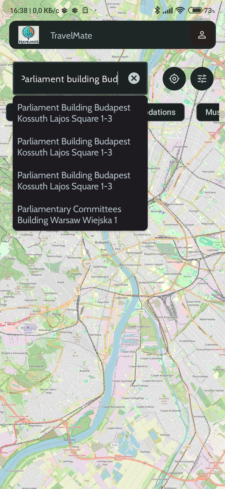
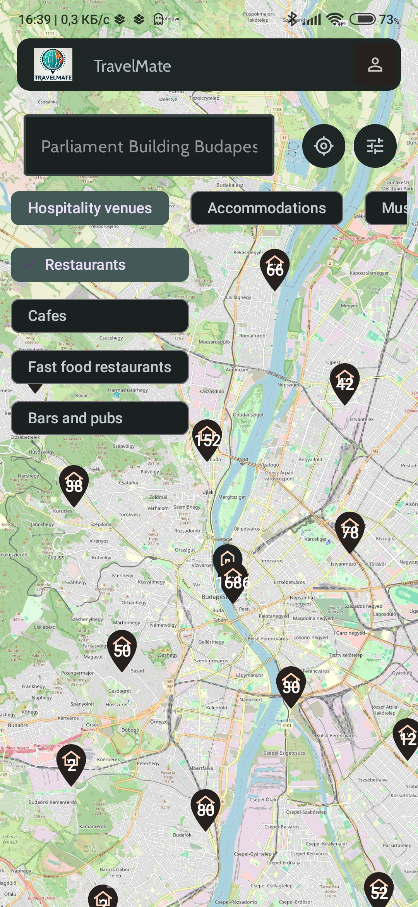
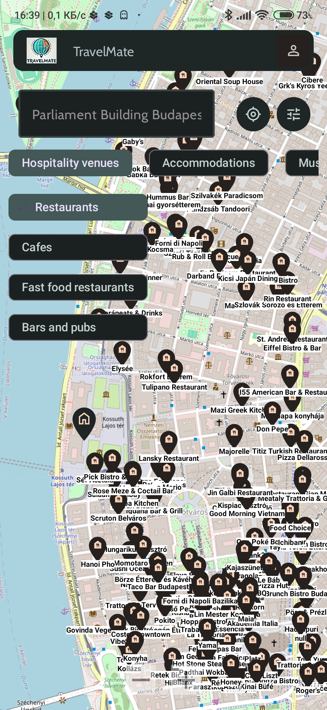
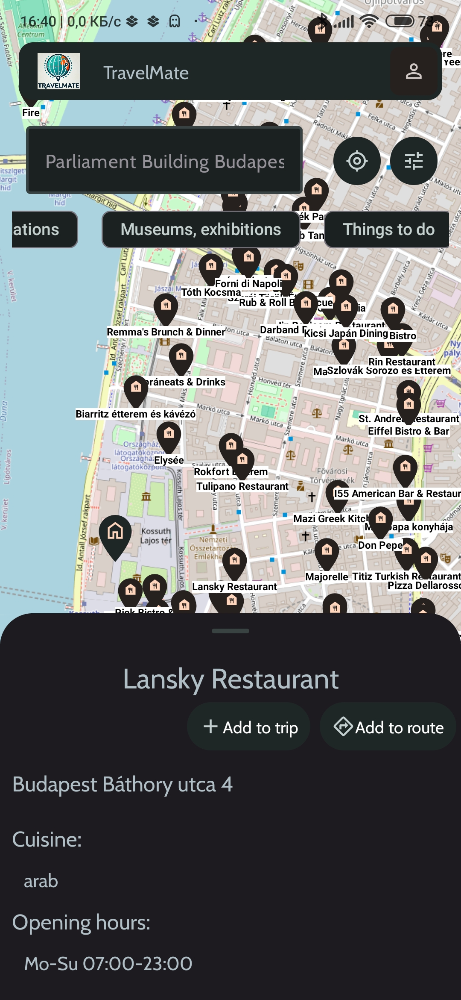
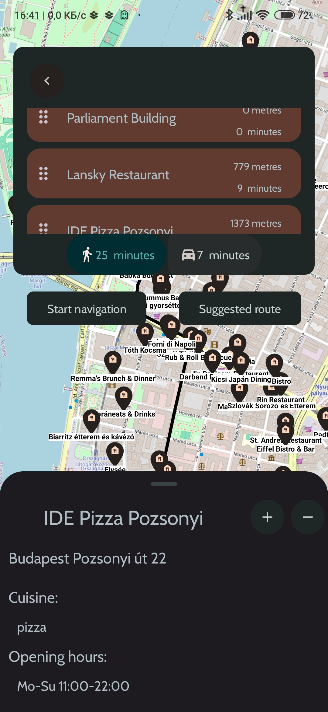
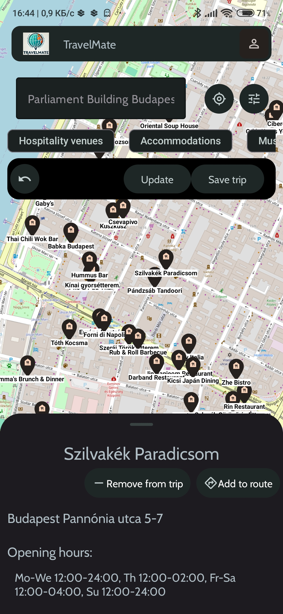
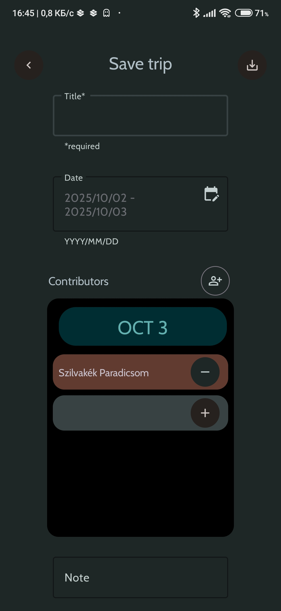
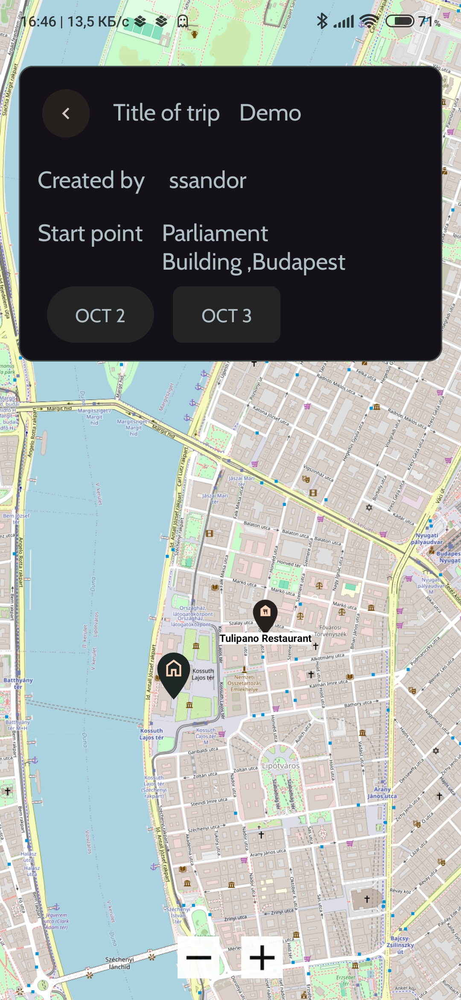

# TravelMate

An Android application built to facilitate planning travels, leisure programs and activities.
Users can search for points of interst, plan multi-stop routes, navigate with GPS, and collaborate with friends to create trips.

---

## Features

- **Place search and discovery**
  - Find places nearby based on several categories such as hospitality venues, accomodations, landmarks, museums etc.
  - Search by name, address, or use the current GPS location as the starting point
  - Filter results based on the duration and mode of travel

- **Route planning and navigation**
  - Create optimized routes across multiple selected places
  - Get turn-by-turn GPS navigation

- **Save, share and collaboration**
  - Plan, then save or share trips with others using Firebase real-time sync
  - Collaborate with friends to plan trips ( add or remove stops together)

### Screenshots
 <div align="center">

  
  
  
  
  
  
  
  
  
   
 </div>

---
   
## Tech stack

- **Android ( Kotlin )**
- **Map and location**: OpenStreetMap (OSMDroid, OSMBonusPack), Fused Location Provider
- **Data storage**: Firebase ( Realtime Database, Cloud Storage), Room ( SQLite, Local Storage)
- **Network**: Retrofit ( for places data from OverpassAPI, routes, geocoding from OpenRouteService (ORS) )
- **Architecture**: Clean architecture
- **Build tools**: Gradle

## How to build

### Prerequisites
- Android Studio
- OpenRouteService (ORS) API key
- Firebase Realtime Database project + Authentication enabled

### Installation

```bash
git clone https://github.com/SzaboSandor1016/TravelMate.git
cd TravelMate
```

or download and install directly on a device using the latest APK: [Download APK](https://github.com/SzaboSandor1016/TravelMate/releases/download/v1.0.0-alpha/app-debug.apk)

### Running
- Open the project in Android Studio
- Add the ORS API key to local.properties
- Include the google.services.json as instructed while creating the Firebase Realtime Database project
- Sync Gradle and run on a device with Location and Internet access enabled

## Future improvements
- **Social features**: ratings and reviews
- **Filtering**: filter the results of search by ratings
- **Improved GPS navigation**: Adjust the behavior of navigation.
